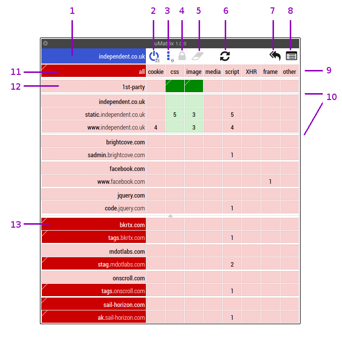
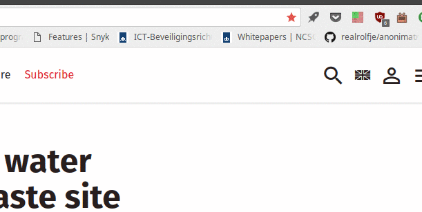
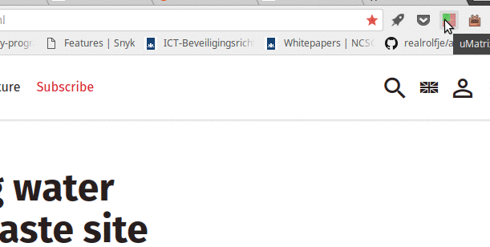
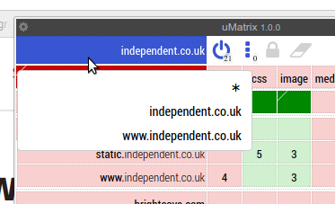
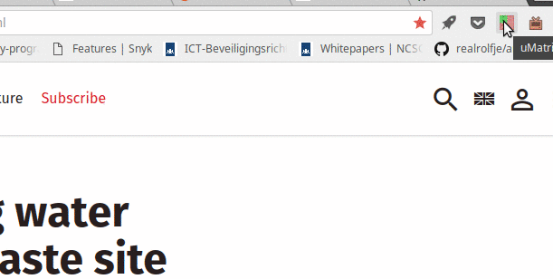

% umatrix tutorial
% Ferry Boender
% October 16, 2017

## About

Umatrix is a content blocker and filter plugin for Firefox, Chrome and Opera.
It gives the user fine-grained control over blocking and allowing of cookies,
CSS, images, media, scripts, XHR, frames and other requests done by the
browser. Think of it as a firewall for your browser. Effectively, it replaces
cookie blockers, ad blockers and script blockers, as well as all privacy
enhancing extensions such as Privacy Badger.

Because umatrix blocks everything by default, you always remain in control of
exactly what each website is allowed to do. Many sites will of course break,
but umatrix makes it easy to unblock things either by default or on a
site-by-site basis.

Umatrix is an extremely powerful tool and unfortunately that means it comes
with a bit of a learning curve. This tutorial tries to make that learning
curve a little less steep.

## First steps

The first step is to install the plugin for your browser:

* [Firefox](https://addons.mozilla.org/firefox/addon/umatrix/)
* [Chrome](https://chrome.google.com/webstore/detail/%C2%B5matrix/ogfcmafjalglgifnmanfmnieipoejdcf)
* [Opera](https://addons.opera.com/en-gb/extensions/details/umatrix/)

In this tutorial I'll be using the Chrome version of umatrix. Other browsers
should work similar.

After installation, an icon will be added to the extensions area:

Whenever you visit a site, the icon will change to show what's being blocked
and what is being allowed. Clicking on the icon brings up the filtering
interface for that website.

For this tutorial I'll use 
[the first article](http://www.independent.co.uk/news/world/americas/puerto-rico-latest-drinking-water-aid-response-superfund-dorado-site-a8000686.html)
I found on reddit's front page as the site which we'll be blocking and
allowing content on.

If we click the umatrix icon, the main interface pops up:

The interface is a matrix (hence the name) of rows and columns that let you
selectively block and unblock what you want. Let's go through the interface.
I've labeled each element with a number. Here's what those numbers mean:

1. This is the **scope selector**. It determines on what level (global,
   domain, subdomain) blocking and unblocking elements has an effect.
   Basically this lets you set defaults for all websites or specific websites.
2. **Disable / enable matrix filtering**. This toggles blocking of all
   requests for the current scope.
3. **Option toggles**, such as turning on and off User Agent spoofing.
4. **Save** all temporary changes you've made to the current scope (website).
   Effectively, this lets you save your preferences for a website.
5. **Revert** all temporary changes you've made to the current scope. This
   loads the changes you've previously saved for this scope, or resets them to
   the default values if you have no saved changes.
6. **Reload current website**. Reloads the website without closing the matrix.
   This is essential for when you need to figure out which resources you
   should unblock if you want to get a specific part of the website working.
7. **Revert all temporary changes**. Mostly the same as 5, except for all
   scopes and all websites.
8. Bring up the **logger**, which lets you see all requests made by your
   browser and whether those requests were blocked or not.
9. A **row in the matrix** and more specifically, the "All" row. Clicking in the
   columns of the "All" row lets you toggle blocking of that resource for all
   rows in the matrix. 
10. **Domain dividers** are marked by a larger border between rows than other
    rows. This subdivides the matrix into areas that have effect on a single
    domain. The top row in a subdivision toggles blocking for all subdomains
    in that division.
11. The **All Cell**, when clicked, toggles between blocking and allowing
    everything in the matrix. Unlike the "disable / enable matrix filtering"
    \(2) button, these changes can be saved.
12. The **1st party** row is special. "1st party" refers to the website that
    you actually intended to visit. For example, if you go to
    https://www.reddit.com, then "reddit.com" is a 1st party website, and so
    is everything under reddit.com. Anything not under reddit.com, such as
    https://i.redd.it, is not considered 1st party.
13. Dark-red colored cells are blocked. Dark-red colored cells in the first
    column point to either manaully blocked or filter list blocked domains.
    Umatrix supports filter lists just like most ad blockers do.

## Rows, Columns and cells

Like all matrices, or tables if you will, umatrix consists of rows, columns
and cells. Each can be clicked in the top and bottom part of the cell. The top
of the cell unblocks that resource and the bottom of the cell blocks it:

Umatrix shows cells with different colors:

* **light-red**: The resource is blocked by default.
* **dark-red**: The resource has been manually set to be blocked. Dark-red
  in the domain column (the first one) means that website is being blocked by
  a block list.
* **light-green**: The resource is allowed by default.
* **Dark-green**: The resource has been manually set to be allowed.

The columns in the "All" row block or unblock that resource for all rows:

We can see that clicking the top part unblocks (allows) media all the rows /
domains. The entire column turns green. The bottom part blocks it again. Since
the default was already to block it (light red background), the column does
not turn bright red, but just reverts to the default. When we try to block all
images, nothing appears to happen. This is because the "1st party" (and thus
the domains under "independent.co.uk") have been manually set to allow. This
overrides the "All" setting.

We can also see that the "Save" and "Revert" icons become active. If we choose
to save our current changes, umatrix will use those settings on our next visit
to this page / scope. Otherwise, on a next visit, the default settings will be
used again.

Each cell shows the number of requests made for the current website.  If we
wanted to selectively allow scripts from "static.independent.co.uk" and
"www.independent.co.uk", we can click in the top part of those cells and hit
reload to refresh the current page.

We can also enable whole sections at once by clicking the top of the cell in
the first row of a section:

After reloading, you may notice new rows appearing in the matrix. Scripts may
try to load additional resources, which may be blocked by umatrix. Once we are
satisfied with our changes, we can click the "Save" icon to save those changes
for next time we visit this website.

You may have noticed the tiny little triangle in the top-left corner of each
cell. That triangle indicates the default value for that cell. If you click
the `Revert` button (the little eraser), the cell will revert to the color in
this little corner.

## The Scope selector

The blue cell in the top left corner is the scope selector. It determines on
what level blocking and unblocking elements has an effect. Clicking it brings
up a pop-up:
   

As you can see there are three scopes: "`*`" is the global scope. If you
select this scope and block a resource or group of resources (such as a cookie
or all scripts), that block will be applied on every website. Think of it as
the **default blocking settings**. To change them, select the "`*`" scope,
make your changes and hit the save button. Afterwards, you'll want to switch
back to the second scope ("independent.co.uk" in this case).

Say we start with all resources blocked for everything. Now, we want to enable
the loading of images and CSS, but *only* for 1st party domains. So if we
visit https://www.reddit.com, we want CSS and images loaded from
https://reddit.com, https://www.reddit.com and maybe something like
https://images.reddit.com, but not from https://www.imgur.com or
https://www.evil-ads.com.

We can do so by changing the scope to "`*`", enabling the CSS and Images
column for the `1st party` row, saving our changes and then switch back to the
normal scope:

We see that the images and CSS are now enabled for `*.independent.co.uk`. If
we browse to a different site, such as `github.com`, we'd see that images and
CSS are allowed for `*.github.com`.

If we want to allow CSS and image loading for every domain, regardless of
whether it's a first party domain:

You won't be using the scope selector much, except for when you just installed
umatrix and want to set some defaults. I suggest blocking everything by
default and only enabling CSS and images for first-party sites by default (the
"`*`" scope). Don't forget to save your changes!

## Conclusion

You should now have a decent idea on how to use umatrix:

1. Set your personal default blocking preferences in the "`*`" scope, save
   your changes and switch back to the default scope.
1. Visit a website.
1. Unblock blocked requests if the site does not work properly.
1. Reload using the "reload" button.
1. Repeat until the site works for you.
1. Save your changes if you'll be visiting this site again.

Within a few hours of browsing, most of your regular sites will work properly.

Don't forget that once you're used to umatrix, you don't need any other
blocking extensions anymore! You can get rid of *ublock origin*, *privacy
badger*, *noscript*, and any other extension you may have installed to protect
you.

One tip before this article ends: You may want to install the 
[Mercury Reader plugin](https://chrome.google.com/webstore/detail/mercury-reader/oknpjjbmpnndlpmnhmekjpocelpnlfdi?hl=en)
for Chrome. It lets you view articles without all the clutter. It works great
in combination with umatrix.
